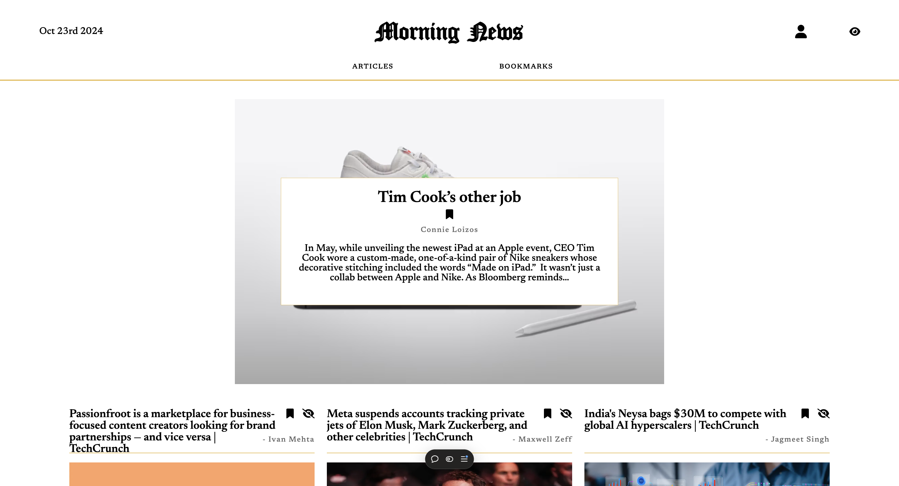

# Morning News

**Morning News** is a full-stack web app that displays the latest technology news from **TechCrunch** via **NewsAPI**. Users can sign up, sign in, and save their favorite articles.

## Live Demo

Visit the live application at: [https://morning-news-vinesk.vercel.app](https://morning-news-vinesk.vercel.app)

## Features

- **User Authentication**: Sign up, sign in, log out.
- **Bookmarks**: Save and manage favorite articles.
- **Redux for State Management**.
- **Secure Auth**: Password hashing, tokens.
- **Persistent Store**: Remain logged in and keep bookmarks after page refresh.
- **Hide Articles**: Hide articles that have been read.

## Tech Stack

**Frontend**: React, Next.js, Redux  
**Backend**: Node.js, Express, MongoDB  
**Deployment**: Vercel

## Project Structure

```
morning-news/
├── frontend/          # Next.js frontend
├── backend/           # Express backend
└── package.json       # Root package.json with workspaces
```

## Setup

1. Clone the repository:

   ```bash
   git clone https://github.com/vinesk/morning-news.git
   cd morning-news
   ```

2. Install dependencies:

   ```bash
   yarn install
   ```

3. Set up environment variables:

   Frontend (.env.local in frontend folder):

   ```bash
   NEXT_PUBLIC_BACKEND_URL=https://your-backend-url
   ```

   Backend (.env in backend folder):

   ```bash
   CONNECTION_STRING=your-mongodb-uri
   NEWS_API_KEY=your-newsapi-key
   ```

4. Start development servers:

   ```bash
   # Start both frontend and backend
   yarn dev

   # Or start them separately
   yarn workspace frontend dev
   yarn workspace backend start
   ```

## Usage

- **Browse News**: View TechCrunch articles.
- **Bookmark**: Save favorite articles.
- **Hide**: Mark articles as read to hide them.

## Development

- Frontend runs on: `http://localhost:3001`
- Backend runs on: `http://localhost:3000`

## License

MIT License. See the [LICENSE](./LICENSE) file for details.
