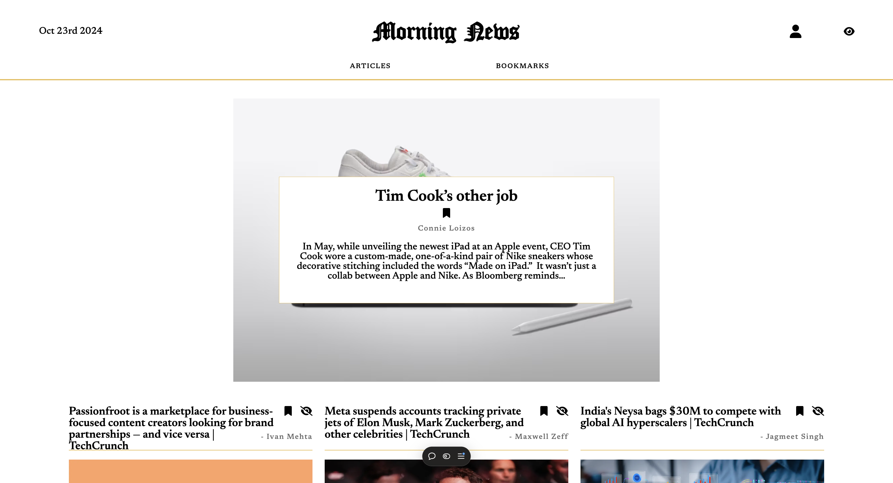

# Morning News

**Morning News** is a full-stack web app that displays the latest technology news from **TechCrunch** via **NewsAPI**. Users can sign up, sign in, and save their favorite articles.

## Live Demo

Visit the live application at: [https://lacapsule-morningnews-frontend.vercel.app](https://lacapsule-morningnews-frontend.vercel.app)

## Features

- **User Authentication**: Sign up, sign in, log out.
- **Bookmarks**: Save and manage favorite articles.
- **Redux for State Management**.
- **Secure Auth**: Password hashing, tokens.
- **Persistent Store**: Remain logged in and keep bookmarks after page refresh.
- **Hide Articles**: Hide articles that have been read.

## Tech Stack

**Frontend**: React, Next.js, Redux  
**Backend**: Node.js, Express, MongoDB  
**Deployment**: Vercel

## Repositories

- **Frontend**: [lacapsule-morningnews-frontend](https://github.com/vinesk/lacapsule-morningnews-frontend)
- **Backend**: [lacapsule-morningnews-backend](https://github.com/vinesk/lacapsule-morningnews-backend)

## Setup

### Frontend

1. Clone the frontend repo:

   ```bash
   git clone https://github.com/vinesk/lacapsule-morningnews-frontend.git
   cd lacapsule-morningnews-frontend
   ```

2. Install frontend dependencies:

   ```bash
   npm install
   ```

3. Create a `.env.local` file with the following:

   ```bash
   NEXT_PUBLIC_BACKEND_URL=https://your-backend-url
   ```

4. Start the frontend:

   ```bash
   npm run dev
   ```

### Backend

1. Clone the backend repo:

   ```bash
   git clone https://github.com/vinesk/lacapsule-morningnews-backend.git
   cd lacapsule-morningnews-backend
   ```

2. Install backend dependencies:

   ```bash
   npm install
   ```

3. Create a `.env` file with the following:

   ```bash
   CONNECTION_STRING=your-mongodb-uri
   NEWS_API_KEY=your-newsapi-key
   ```

4. Start the backend:

   ```bash
   npm run start
   ```

## Usage

- **Browse News**: View TechCrunch articles.
- **Bookmark**: Save favorite articles.
- **Hide**: Mark articles as read to hide them.

## License

MIT License. See the [LICENSE](./LICENSE) file for details.
